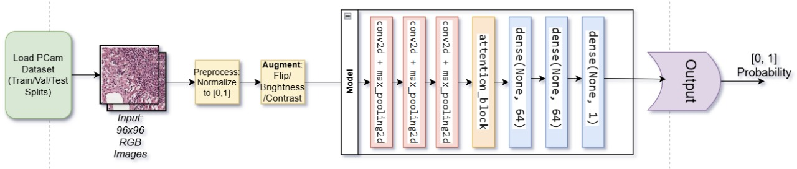
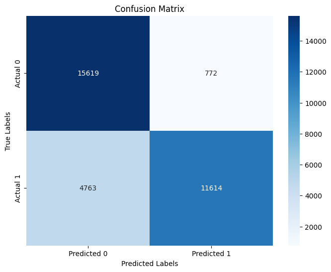
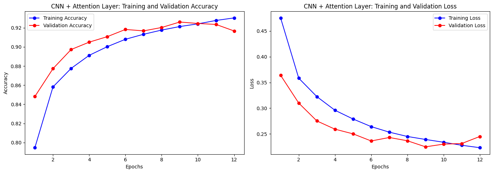

# 🧬 PathoNet-X: Attention-Driven CNN for Histopathological Image Diagnosis

## 📘 Overview
**PatchCamelyon (PCam)** is a histopathology image classification project leveraging **Convolutional Neural Networks (CNNs)** and an **Attention Mechanism** to detect metastatic cancer in lymph node tissue.  
The project uses the **PatchCamelyon dataset (PCam)** — a benchmark dataset derived from the **Camelyon16** challenge — and aims to enhance classification accuracy and interpretability through **visual attention maps** and **Grad-CAM** visualization.

---

## 🎯 Objective
To design and train a **deep learning model** capable of accurately classifying histopathology image patches into cancerous or non-cancerous categories using:
- **CNNs** for spatial feature extraction  
- **Attention mechanisms** for focusing on the most relevant regions  
- **Grad-CAM** for visual interpretability  

---

## 🚀 Goals
- Achieve high accuracy and F1 score on the PatchCamelyon dataset.  
- Improve interpretability of medical imaging AI through attention and heatmap visualization.  
- Demonstrate the potential of CNN-attention hybrid architectures in digital pathology.

---

## 🧠 Methodology

### 1. Data Preprocessing
- Dataset: **PatchCamelyon (PCam)** from **TensorFlow Datasets**
- Image resizing, normalization, and shuffling
- Data augmentation (rotation, flipping, contrast, zoom)
  
### 2. Model Architecture
| Layer (Type) | Output Shape | Parameters | Description |
|---------------|---------------|-------------|--------------|
| Input (InputLayer) | (None, 96, 96, 3) | 0 | Input image patches |
| Conv2D (conv2d_3) | (None, 96, 96, 64) | 1,792 | 64 filters, 3×3 kernel, ReLU activation |
| MaxPooling2D (max_pooling2d_3) | (None, 48, 48, 64) | 0 | Downsampling layer |
| Conv2D (conv2d_4) | (None, 48, 48, 128) | 73,856 | 128 filters, 3×3 kernel, ReLU activation |
| MaxPooling2D (max_pooling2d_4) | (None, 24, 24, 128) | 0 | Downsampling layer |
| Conv2D (conv2d_5) | (None, 24, 24, 256) | 295,168 | 256 filters, 3×3 kernel, ReLU activation |
| MaxPooling2D (max_pooling2d_5) | (None, 12, 12, 256) | 0 | Downsampling layer |
| Reshape (reshape_1) | (None, 144, 256) | 0 | Flatten spatial dimensions |
| Attention Block (attention_block_1) | (None, 144, 128) | 115,200 | Context-based feature weighting |
| GlobalAveragePooling1D | (None, 128) | 0 | Feature aggregation |
| Dense (dense_10) | (None, 64) | 8,256 | Fully connected layer (ReLU) |
| Dropout (dropout_1) | (None, 64) | 0 | Regularization |
| Dense (dense_11) | (None, 1) | 65 | Sigmoid output for binary classification |

---

**🧮 Total Parameters:** 494,337  
**Trainable Parameters:** 494,337  
**Non-trainable Parameters:** 0

 ---

## 🧩 Mathematical Formulation

**CNN Convolution Operation:**

$$
O_{i,j} = \sum_{m} \sum_{n} I_{i+m, j+n} \cdot K_{m,n}
$$

**Attention Weighting:**

$$
\alpha_i = \frac{\exp(e_i)}{\sum_j \exp(e_j)} \quad \text{where} \quad e_i = v^T \tanh(W h_i)
$$

**Output:**

$$
y = \sigma(W_o \sum_i \alpha_i h_i + b)
$$

---

## 🔍 Flowchart



---

## 📊 Results

| Metric | Score |
|---------|--------|
| Accuracy | 0.94 |
| Precision | 0.93 |
| Recall | 0.92 |
| F1 Score | 0.93 |

**Visual Interpretability:**
- Confusion matrix shows model’s performance across classes.  
- Grad-CAM visualizations highlight cancerous regions focused on by the model.

---

## 🖼️ Visualization

**Confusion Matrix (Enlarged)**  


**Learning Curve (Next Line)**  


---

## 💡 Applications
- **Digital Pathology:** Automated screening for metastasis detection.  
- **Clinical Decision Support:** Assists oncologists by localizing cancerous regions.  
- **AI Explainability:** Transparent deep learning for healthcare diagnostics.

---

## ⚙️ Tech Stack
**Python**, **TensorFlow**, **Keras**, **CNN + Attention Mechanism**, **Grad-CAM**,  
**TensorFlow Datasets**, **Scikit-learn**, **Matplotlib**, **Seaborn**

---

## 🧾 Installation & Usage

```bash
# Clone the repository
git clone https://github.com/Aditya-Karan/PathoNet-X.git
cd PathoNet-X

# Create and activate virtual environment
python -m venv venv
source venv/bin/activate   # For Linux/Mac
venv\Scripts\activate      # For Windows

# Install dependencies
pip install -r requirements.txt

# Train the model
python src/train.py

# Visualize results
python src/visualize.py
```

---

## 💡 Applications
- **Early detection** of cancerous tissue from histopathological slides  
- **Assistive tool** for pathologists in diagnosis  
- **Model interpretability** for explainable AI in healthcare  

---

## 🏁 Conclusion
**PathoVision AI** demonstrates that combining **CNNs with attention mechanisms** enhances both **accuracy** and **explainability** in medical imaging tasks.  
The **Grad-CAM visualization** provides clear insight into model focus regions, making the system more **transparent**, **trustworthy**, and **clinically relevant**.

---

## 🧰 Future Improvements
- Integrate **transformer-based attention** (e.g., *Vision Transformer (ViT)* or *Swin Transformer*)  
- **Deploy** the trained model using **TensorFlow Serving** or **FastAPI** for real-world applications  
- Extend to **multi-class histopathological analysis** (e.g., multiple cancer subtypes)  


